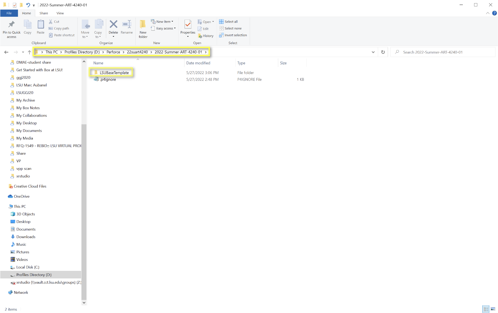
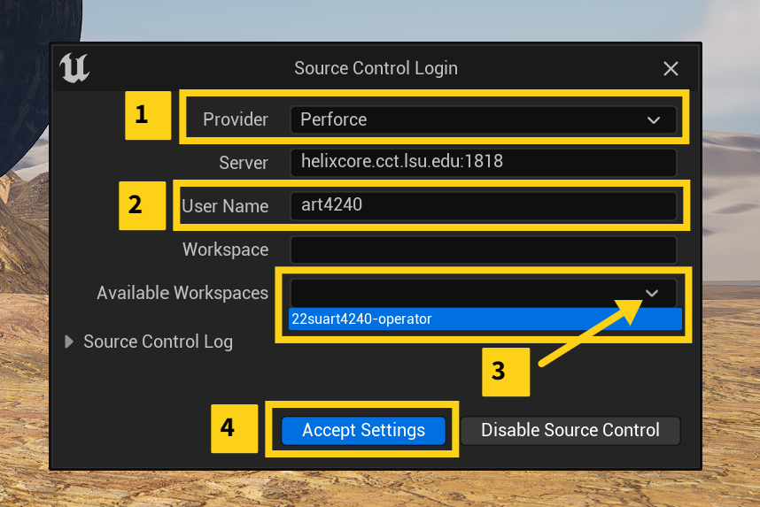
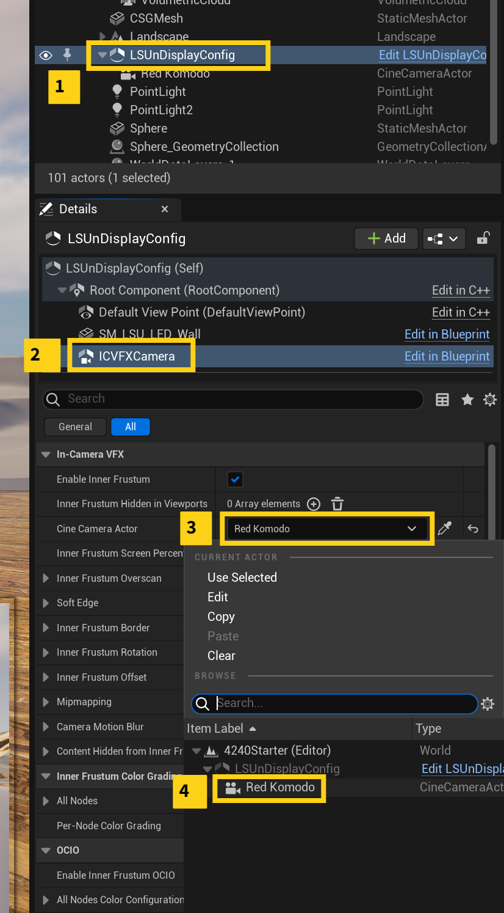

### Building Levels

[previous](https://github.com/maubanel/p4v-unreal) • [home](../README.md) • [next](../)

When you've setup Perforce and you want to start making levels in Unreal follow the procedures below to make sure you're staying in sync with perforce and each level is setup for nDisplay.

 

---

#### Pre-req
1. Setup Perforce on your local machine by following the steps in this repo: https://github.com/maubanel/p4v-unreal

#### Add to Guide
- [ ] Finish the OpenColorIO section.
- [ ] Write an alternative process with multiple levels in the Level Window. 

---

1. When you want to make a new project, Copy and Paste the LSUBaseTemplate from the “Template” Depot folder into the class/group Depot folder.  

    

    
    
1. Rename this template folder *and* Unreal project to a new project name. Be mindful to keep the name under 20 characters for Unreal.

1. Before opening Unreal, open P4V to make sure you're logged in to the right workspace with the right user name. For VAD computers this should be your own username. For Operator and Render computers this should be a generic login like art4240-render.

1. Then, in P4V make sure you have your Unreal project folder highlighted and then click **Submit** to make sure there are no lingering changes.

1. Next, click **Get Latest** to make sure you have all the up to date files.

1. Now, you can open up your Unreal project from P4V by double click the .uproject from within the P4V window.

1. For source control, it's useful to turn on auto check out before getting started. Do this by going to Edit > Editor Preferences > General - Loading & Saving > Source Control and tick on **Automatically check out on asset modification**.

1. In Unreal, make sure source control is running by hovering your mouse over the word **Source Control** in the bottom right corner of the screen. It should say connected. If it doesn't say connected, click the word Source Control. Fill in the following info.

    - Provider: `Perforce`
    - Server: `ssl:helixcore.cct.lsu.edu:1818`
    - User Name: `Your personal username or generic login.`
    - Available Workspaces: `Let this auto-populate and choose the correct one.`
    
    
        
    

1. Finally, you can do one last check to make sure source control is up to date before you start working. To do this rt. click your **Content** folder and click **Sync**.

1. It's not a bad idea to make a small change to an existing file and then try Submitting it back to Source Control to make sure things are setup properly. It this works, you should be good to go.
    
1. Next, click on the LSUnDisplayConfig in the outliner and then in the Details pane select the ICVXFCamera. Under In-Camera VFX > CineCamera Actor choose the Red Komodo in case it's not already selected.
    
    

1. Now, Edit the actual nDisplay actor by double click it and click on ICVFX camera (for the 2nd time) and under Cine Camera Actor choose Red Komodo again.

    
    
1. You can position the nDisplayConfig actor in a good spot so it sees what you want in the scene.

1. Now we shuold make sure OpenColorIO is still setup properly.

1. Save.

1. Click on source control and submit.

#### Resources
* https://docs.unrealengine.com/5.0/en-US/using-perforce-as-source-control-for-unreal-engine/

---

| [previous](https://github.com/maubanel/p4v-unreal)| [home](../README.md) | [next](../)|
|---|---|---|
