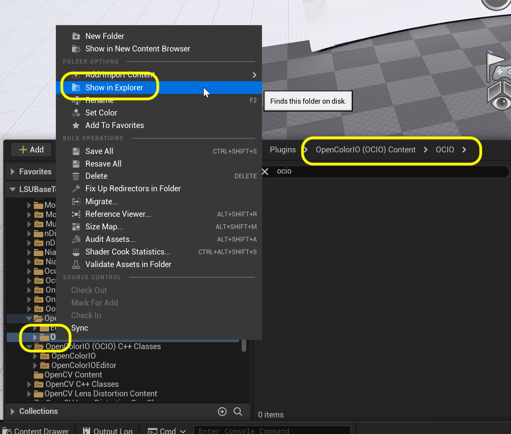
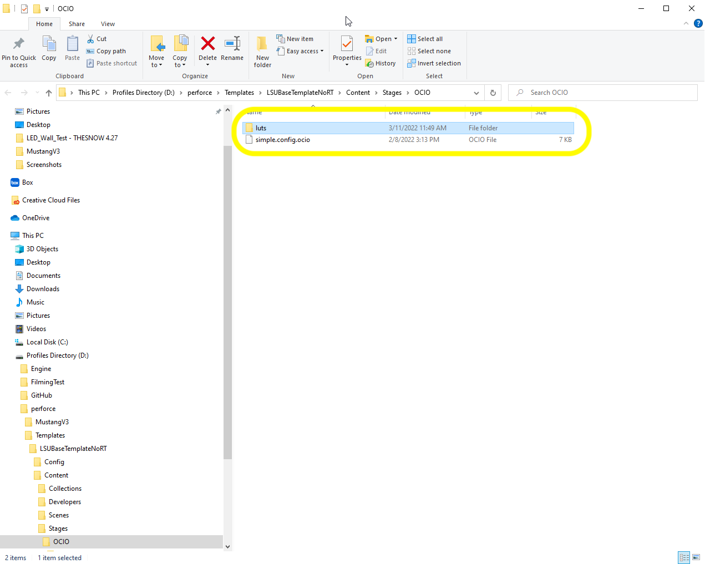
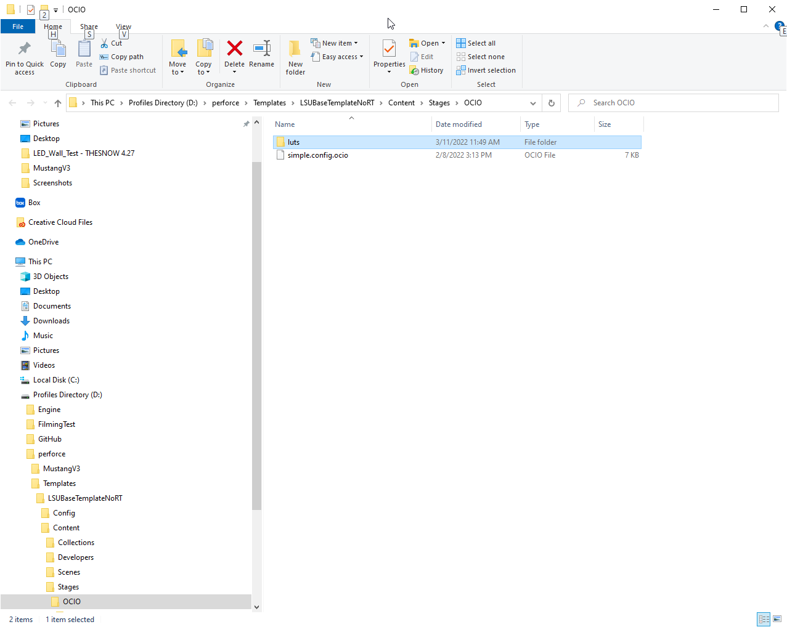
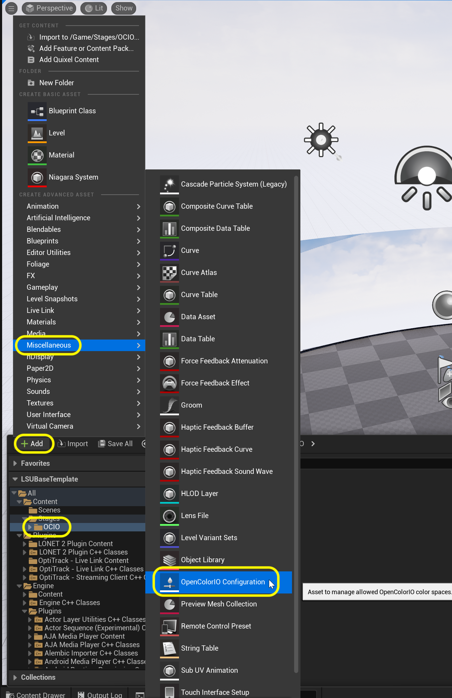
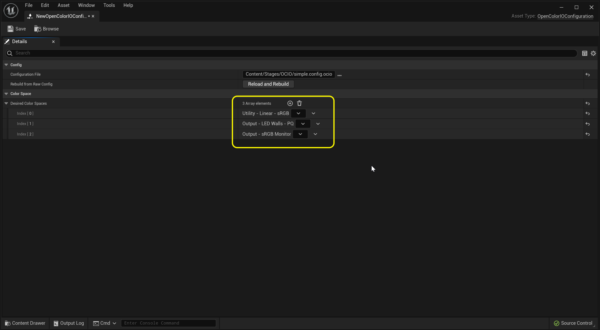
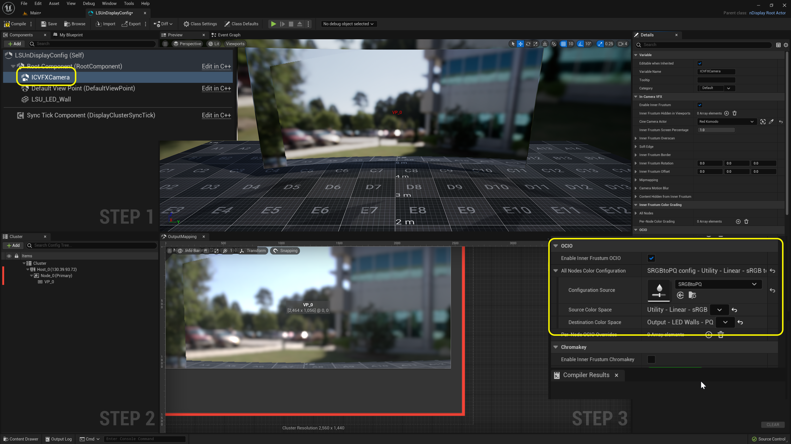
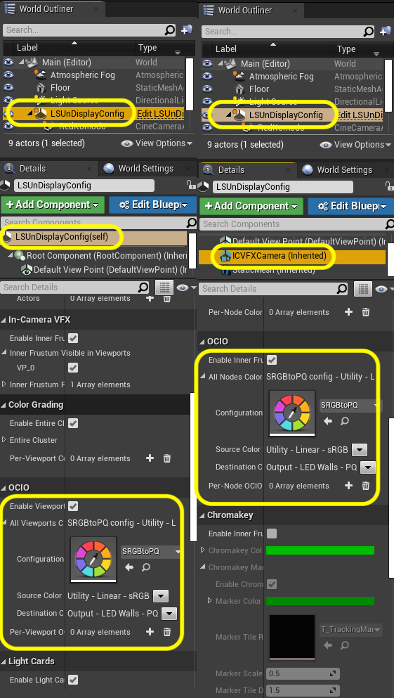
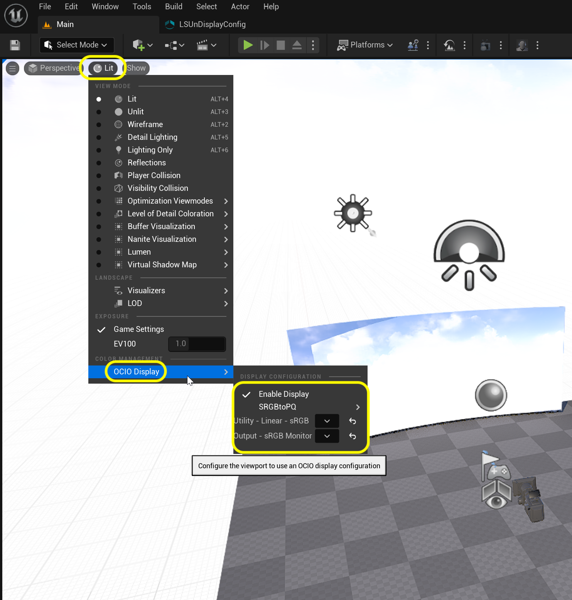
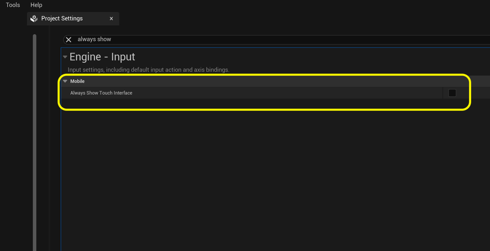
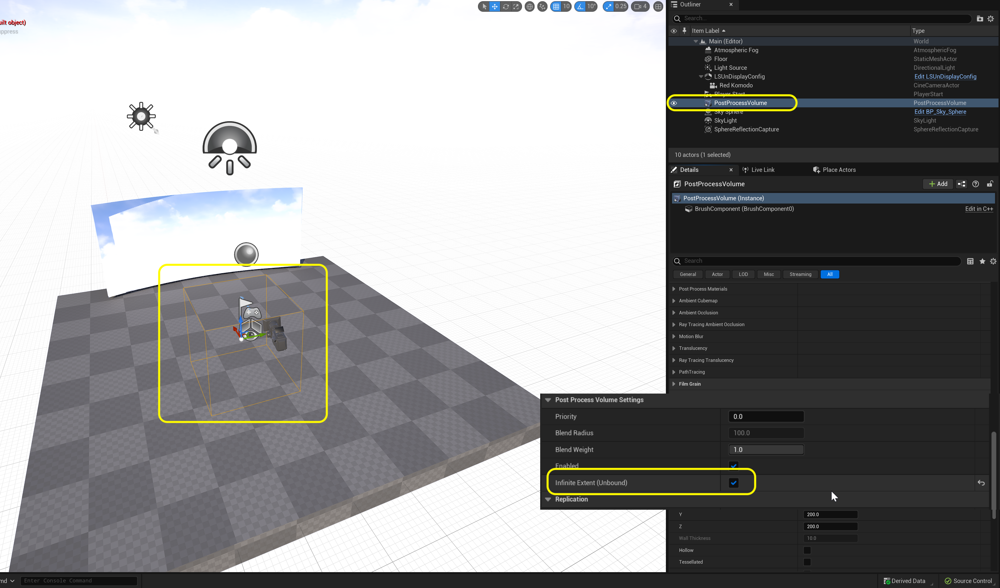

### HDR Output

[previous](../live-link5/README.md#user-content-live-link) • [home](../README.md#user-content-gms2-background-tiles--sprites---table-of-contents)

The LED wall wants to receive a linear HDR signal.  Unreal has been built to output **sRGB** for computer monitors for playing games. There are a few extra steps in configuring the project to output in the correct color space. The monitor uses a **PQ** signal. We need to convert the color to **Linear PQ**.  Please note this will look wrong in your monitor viewing the project, but will look correct on the LED panels.

 

---

##### `Step 1.`\|`BTS`|:small_blue_diamond:

Make sure the **OCIO** plugin is enabled. Click on **View Options** and turn on **Engine Content** and **Plugin Content**.  Search of OCIO.  Now none of the files will show up in Unreal so you will have to right click on the **OCIO** folder and select **Open in Explorer**.

##### `Step 2.`\|`BTS`|:small_blue_diamond: :small_blue_diamond: 

Copy the `simple.config.ocio` and the `luts` folder.

##### `Step 3.`\|`BTS`|:small_blue_diamond: :small_blue_diamond: :small_blue_diamond:

Create a new folder inside of **Stages** called `OCIO`.

##### `Step 4.`\|`BTS`|:small_blue_diamond: :small_blue_diamond: :small_blue_diamond: :small_blue_diamond:

Right click on **Stages | OCIO** and select **Open in Explorer** and now paste the config file and folder into this folder.  Again, this will not show up in Unreal so you will have to confirm it in Explorer. Please note, since it doesn't show up in Unreal you need to use **P4V** to commit the files to source control.  This is very important as your nDisplay machine will not OCIO setup if this is not done.

##### `Step 5.`\|`BTS`| :small_orange_diamond:

Click on the **OCIO** folder and right click on the <kbd>+ Add</kbd> button and select the **Miscellaneous 
| OpenColorIO Configuration** node. Call it `SRGBtoPQ`.  SRGB is the native format that Unreal outputs for games and PQ is an **HDR** format that our **Brompton** processors are set up to receive.

##### `Step 6.`\|`BTS`| :small_orange_diamond: :small_blue_diamond:

Open up the **SRGBtoPQ** file and load the `simple.config.ocio` into the **Configuration File** slote.

##### `Step 7.`\|`BTS`| :small_orange_diamond: :small_blue_diamond: :small_blue_diamond:

Next to **Desired Color Space** press the **+** button next to **Desired Color Space** twice.  In the slot `0` add **Utility | Utility - Linear -sRGB**.  On `1` select **Output | LED Walls - PQ**.  We also need a third output for anyone who is working in Unreal Editor (like operator 1) to get the output color into a sRGB computer monitor color.

##### `Step 8.`\|`BTS`| :small_orange_diamond: :small_blue_diamond: :small_blue_diamond: :small_blue_diamond:

Open the **LSUnDisplayConfig** Blueprint and select the  **OCIO | Configuration Source** selecting the `SRGBtoPQ` item.  Then select the **Source Color Space** as `Utility - Linear - sRGB` and **Destination Color Space** as `Output - LED Walls - PQ`.

##### `Step 9.`\|`BTS`| :small_orange_diamond: :small_blue_diamond: :small_blue_diamond: :small_blue_diamond: :small_blue_diamond:

Repeat the above in the **ICVFX** component in the **LSUnDIsplayACong** Blueprint. Press the <kbd>Compile</kbd> button.

##### `Step 10.`\|`BTS`| :large_blue_diamond:

Double check that in game these settings carry over into the **LSUDisplayConfig** in the **World Outliner**.

##### `Step 11.`\|`BTS`| :large_blue_diamond: :small_blue_diamond: 

Go back to the game editor and click on **Lit** and enable **OCIO Display | Enable Display** with the display going from **Linesar - sRGB to sRGB Monitor**.

##### `Step 12.`\|`BTS`| :large_blue_diamond: :small_blue_diamond: :small_blue_diamond: 

Right now the template defaults to showing the two controller for touch screens.  Turn them off by going to **Project Settings** and turn off `Always Show Touch Interface`.

##### `Step 13.`\|`BTS`| :large_blue_diamond: :small_blue_diamond: :small_blue_diamond:  :small_blue_diamond: 

Now we need to turn off some of the game rendering features that are trying a mimic a real lens (like Bloom) as we want our camera on set to do these effects natively in camera.  Make sure you set **Infinite Extent(Unbound)** to `true`.

##### `Step 14.`\|`BTS`| :large_blue_diamond: :small_blue_diamond: :small_blue_diamond: :small_blue_diamond:  :small_blue_diamond: 

In the **Post Production Volume** set the **Bloom | Intensity** to `0`, the **Vignette Intensity** to `0`, the **Tone Curve Amount** to `0`, the **Expand Gamut** to `0` and the **Blue Correction** to `0`.

##### `Step 15.`\|`BTS`| :large_blue_diamond: :small_orange_diamond: 

Now we can finish by downloading a few textures we might use for monitor calibratoin.  Add the [T_Calibratoin.png](images/T_Calibration.png) and [T_CalibrationTester.png]()files.

___

| [previous](../live-link5/README.md#user-content-live-link)| [home](../README.md#user-content-gms2-background-tiles--sprites---table-of-contents) | 
|---|---|
