### nDisplay Config

[previous](../unreal-base-setup/README.md#setting-up#user-content-setting-up) • [home](../README.md#user-content-gms2-background-tiles--sprites---table-of-contents) • [next](../live-link/README.md#user-content-live-link)

The heart of how the multi view system works in Unreal is through a plugin called nDisplay.  

 

---

##### `Step 1.`\|`BTS`|:small_blue_diamond:

First we need a 3-D representation of our wall in exact dimesions.  Download the static mesh [LSU_LED_Wall.FBX](../files/LSU_LED_Wall.FBX).

##### `Step 2.`\|`BTS`|:small_blue_diamond: :small_blue_diamond: 

Drag the fbx you downloaded above into the **Stages** folder. Turn off **Generate Missing Collision**  and accept all the other default settings for importing FBXs. Press the **Import All** button to import the static mesh of the LSU LED volume.

##### `Step 3.`\|`BTS`|:small_blue_diamond: :small_blue_diamond: :small_blue_diamond:

It also imported an unneeded **Material** do you can right click and select **Force Delete**.

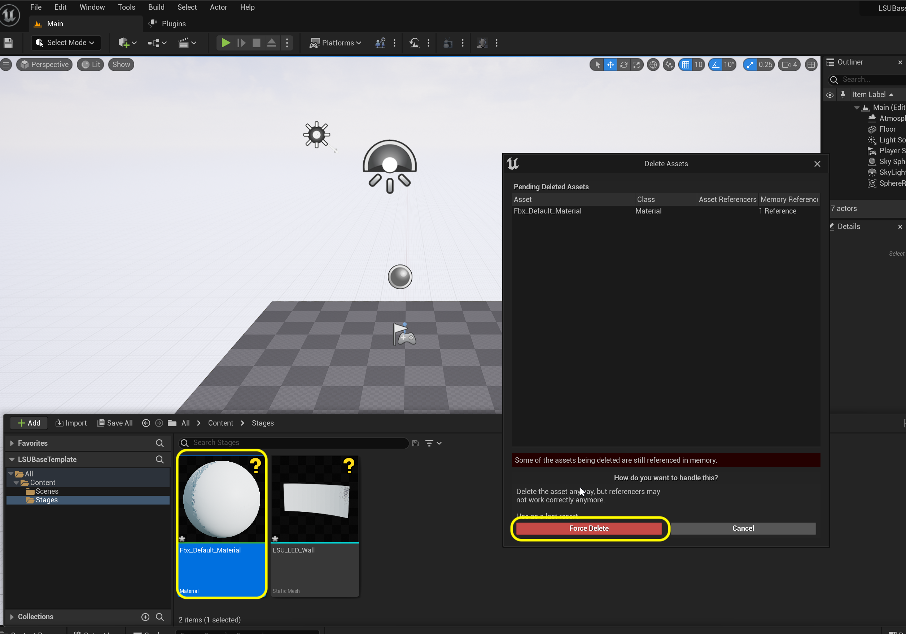

##### `Step 4.`\|`BTS`|:small_blue_diamond: :small_blue_diamond: :small_blue_diamond: :small_blue_diamond:

Open up the static mesh and it is an exact replica of our screen.  It contains two sets of UV's.  UV0 is just a 0 to 1 UV with the entire area filed.  The UV1 has our 6 x 14 grid of screens with the exact ratio of the wall.

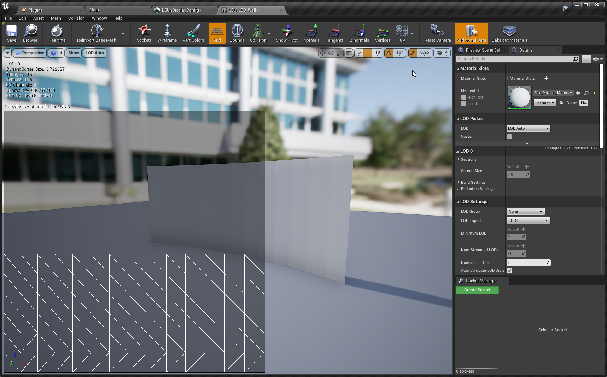

##### `Step 5.`\|`BTS`| :small_orange_diamond:

The only change we need to make to this static mesh is to set **Use Full Precision UVs** to `true`. This uses greater floating point accuracy when calculating the UV's (I believe).

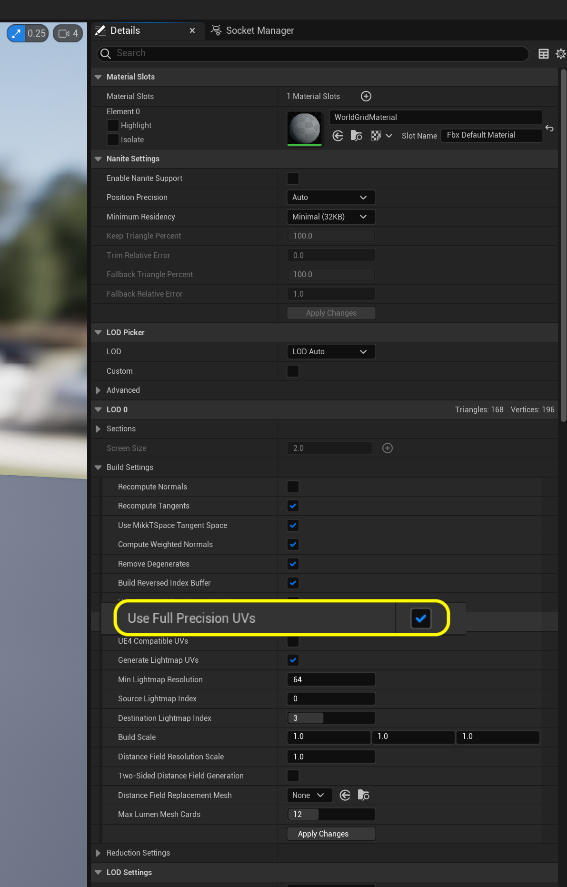

Now the only other special thing is that we have calibrated world 0,0 in our space about 10 feet in front of the center of our screen.  That is where we calibrate all of our 3-D systems.

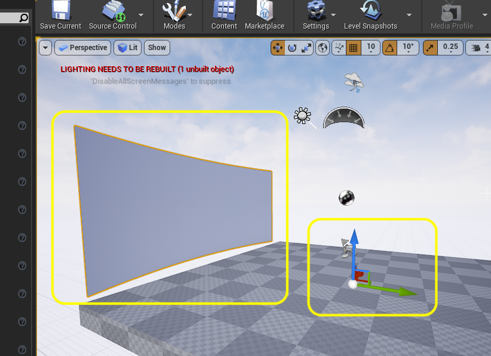

##### `Step 6.`\|`BTS`| :small_orange_diamond: :small_blue_diamond:

Select the **Stages** folder. Press the green <kbd>Add/Import</kbd> button and add a **nDisplay | nDisplay Config** file to the folder. Call this file `LSUnDisplayConfig`.

##### `Step 7.`\|`BTS`| :small_orange_diamond: :small_blue_diamond: :small_blue_diamond:

Open up the **LSUnDisplayConfig** file.  Press the green <kbd>Add Component</kbd> button and add an **ICVFX Camera** and a **Static Mesh**.

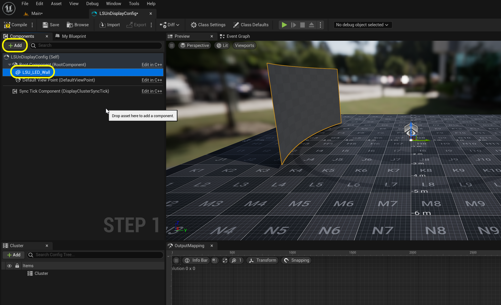

##### `Step 8.`\|`BTS`| :small_orange_diamond: :small_blue_diamond: :small_blue_diamond: :small_blue_diamond:

Click on the **StaticMesh** component and add the **LSU_LED_Wall** to the mesh in the **Details** panel. Erase unused **nDisplaySystem** component.

##### `Step 9.`\|`BTS`| :small_orange_diamond: :small_blue_diamond: :small_blue_diamond: :small_blue_diamond: :small_blue_diamond:

Rotate the mesh so it is in the front of the stage.  The letters should be right side up if we are looking at the screen.

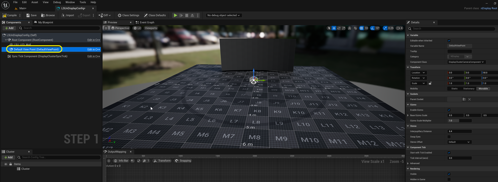

##### `Step 10.`\|`BTS`| :large_blue_diamond:

Now zero out the **Transform** on the static mesh for the screen and the screen does not start on the floor. It is `5.08` cm off of the floor.  We need to adjust the **Z** (+Z is facing up) by `5.08` units (1 unit is 1 cm in Unreal by default).

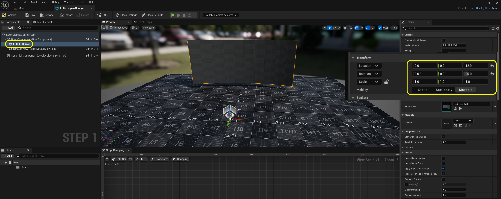

##### `Step 11.`\|`BTS`| :large_blue_diamond: :small_blue_diamond: 

Since our resolution is less than a 4K screen we can use a single cluster node to power the screen.  Right click on **Cluster** and select **Add New Cluster Node**.

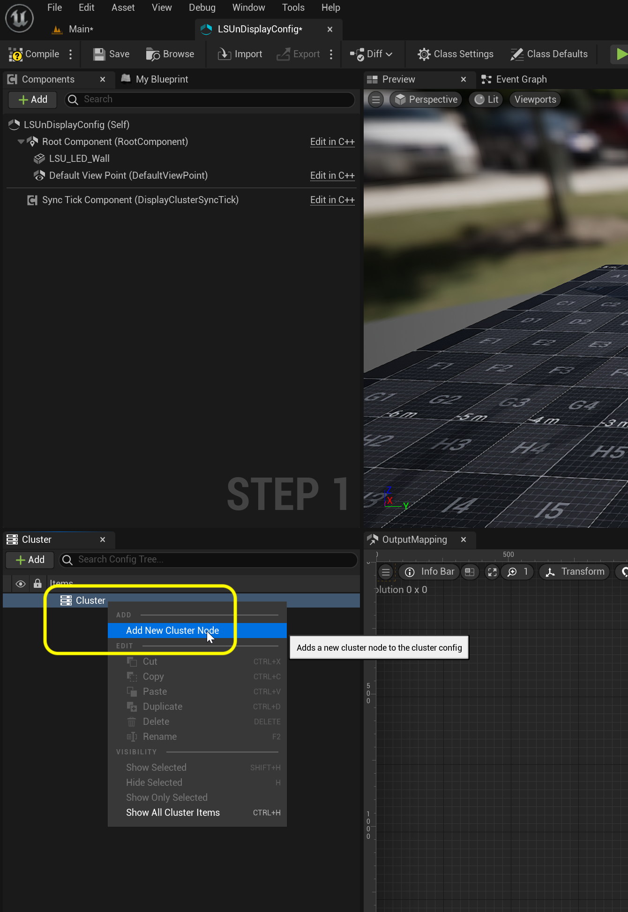

##### `Step 12.`\|`BTS`| :large_blue_diamond: :small_blue_diamond: :small_blue_diamond: 

You can leave the the node named **Node_0**). Make sure the **Parent** is set **Cluster**. Choose the **QHD (2,560 x 1,440)** Preset. That is the size of the entire frame going from Unreal to the Brompton. The game only uses a part of it as the screens don't have this many pixels. The ROE panels are pixels 176 pixels square per panel. We have a grid of 14 tiles wide by 6 tiles tall, thus giving us a resolution of 2464 x 1056, which nestles into the QHD preset. The **IP** of our main machine is `130.39.93.72`. **Enable Sound** and enable **Full Screen**.  Press the <kbd>Add</kbd> key.

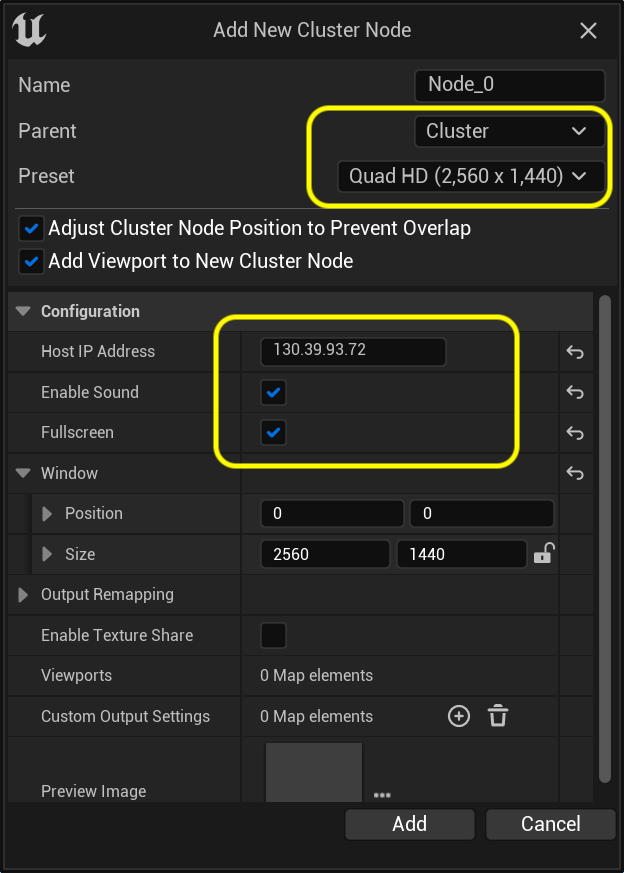

  

##### `Step 13.`\|`BTS`| :large_blue_diamond: :small_blue_diamond: :small_blue_diamond:  :small_blue_diamond: 

Select the **viewport**, likely called `VP_0`, under the Cluster panel. In the Details panel change View Origin to **DefaultViewPoint**. Also, change Projection Policy > Type: Mesh and Projection Policy > Mesh: LSU_LED_Wall.

  

##### `Step 14.`\|`BTS`| :large_blue_diamond: :small_blue_diamond: :small_blue_diamond: :small_blue_diamond:  :small_blue_diamond: 

Now you can move the ICVFX camera around and the frustum should move as well.  We have a single GPU so we leave the **GPU Index** at -1 (which means a single GPU).

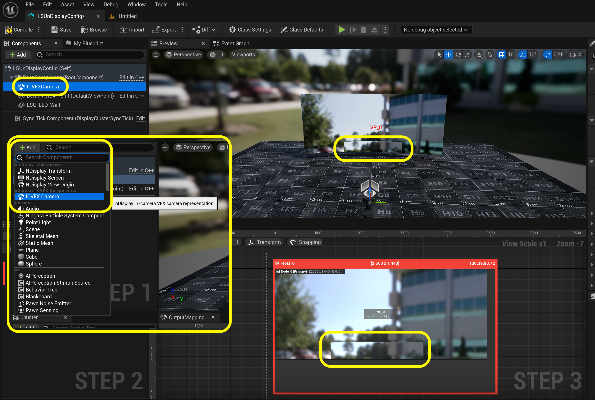

##### `Step 15.`\|`BTS`| :large_blue_diamond: :small_orange_diamond: 

Add **CineCamera** actor to our **Main** level. Also add one copy of the **LSUnDisplayConfig** to the level as well. Make sure the **Z** is at `0` as we don't want to alter the ground position.  The setup can be moved to wherever in a future level you want to place it.  But we want the **Actor** ground level to be `0`, which is what we calibrated our camera to be starting at on **Z**.

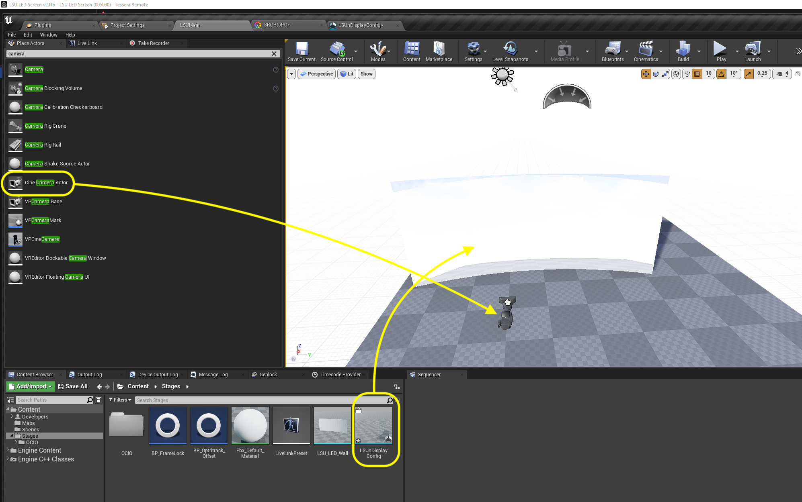

##### `Step 16.`\|`BTS`| :large_blue_diamond: :small_orange_diamond:   :small_blue_diamond: 

Place the **CineCamera** actor in the **World Outliner** to be a child of **LSUnDisplayConfig**.  This way when we move the entire panel the cine camera moves with it.  Make sure the **CineCamera** is at `0,0,0` so we do not offset it.  The position will be given to the camera by the **OptiTrack** system. Name the camera `Red Komodo`.

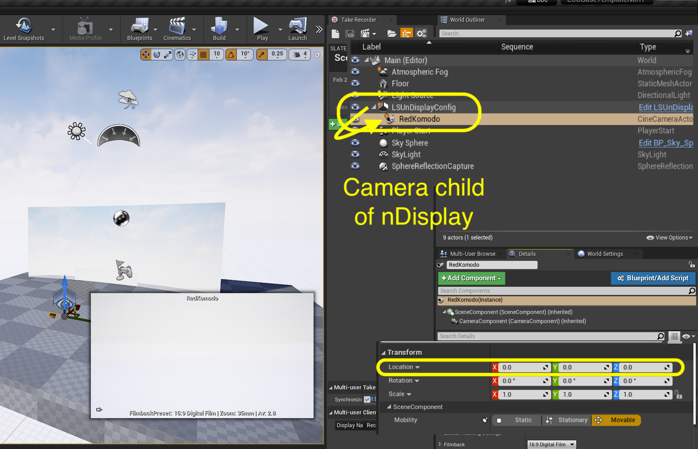

##### `Step 17.`\|`BTS`| :large_blue_diamond: :small_orange_diamond: :small_blue_diamond: :small_blue_diamond:

Go to the **LSUnDisplayConfig** and click on the **ICVX Camera** component and set the reference to the above **Red Komodo** camera.

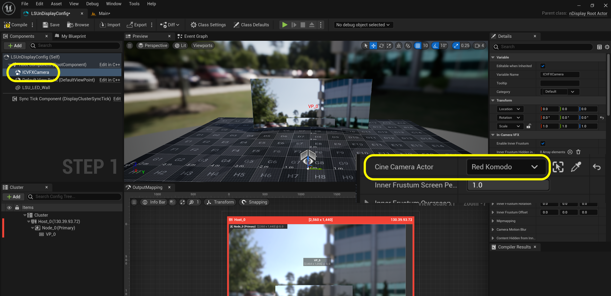

##### `Step 18.`\|`BTS`| :large_blue_diamond: :small_orange_diamond: :small_blue_diamond: :small_blue_diamond: :small_blue_diamond:

Now do the same thing with the **LSUnDisplayConfig** in game and click on the **ICVFX** camera and assign the **Red Komodo** as the camera there as well.

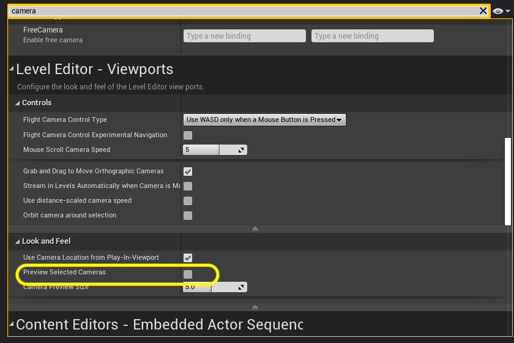

##### `Step 19.`\|`BTS`| :large_blue_diamond: :small_orange_diamond: :small_blue_diamond: :small_blue_diamond: :small_blue_diamond: :small_blue_diamond:

Go to **Edit | Editor Preferences** and go to Level Editor - Viewports | Look and Feel | and turn off Preview Select Cameras

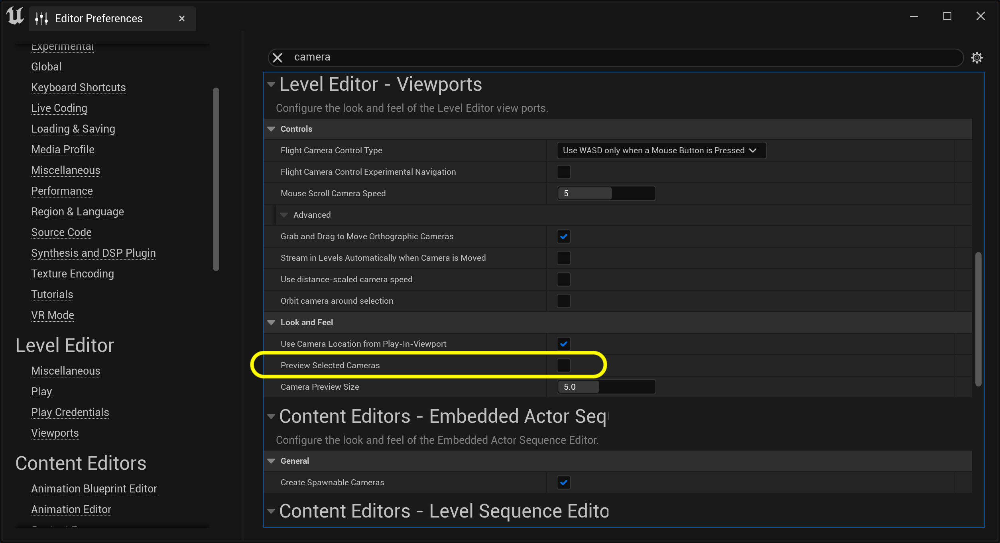

##### `Step 20.`\|`BTS`| :large_blue_diamond: :large_blue_diamond:

Adjust the camera settings.  Our **Red Komodo** has a **Sensor Width** of `27.03` mm, a **Sensor Height** of `14.26` mm when shooting at 6K (6244 x 3250).

It's useful to note that that if the camera is set to UHD (16:9 instead of 17:9) our sensor size is `26.63 x 14.98 mm`. You can use these calculators to determine proportion of the sensor being used for given resolutions: https://www.scantips.com/lights/cropfactor3.html.
  
The current lens on the camera today is a Canon EF 16mm - 35mm 2.8. These values need to change for each lens. It has a **Min Focal Length** of `16.0` mm, a **Max Focal Length** of `35` mm, a **MinFStop** of `2.8`, a **Max FStop** of `22.6` and a **Diaphragm Blade Count** of `8`.

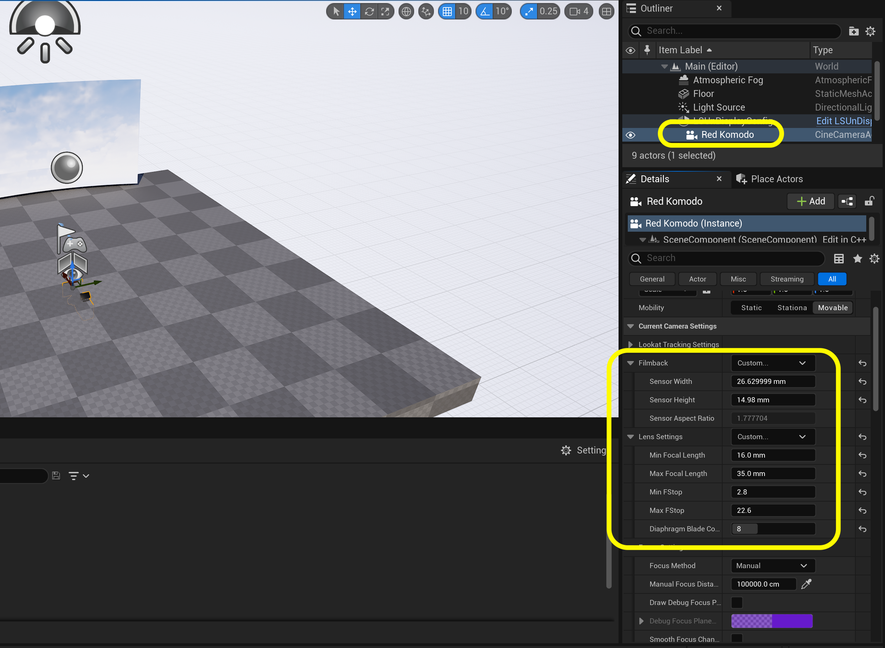

___

| [previous](../unreal-base-setup/README.md#setting-up#user-content-setting-up)| [home](../README.md#user-content-gms2-background-tiles--sprites---table-of-contents) | [next](../live-link/README.md#user-content-live-link)|
|---|---|---|
