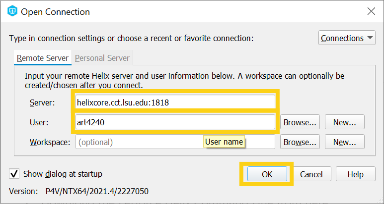
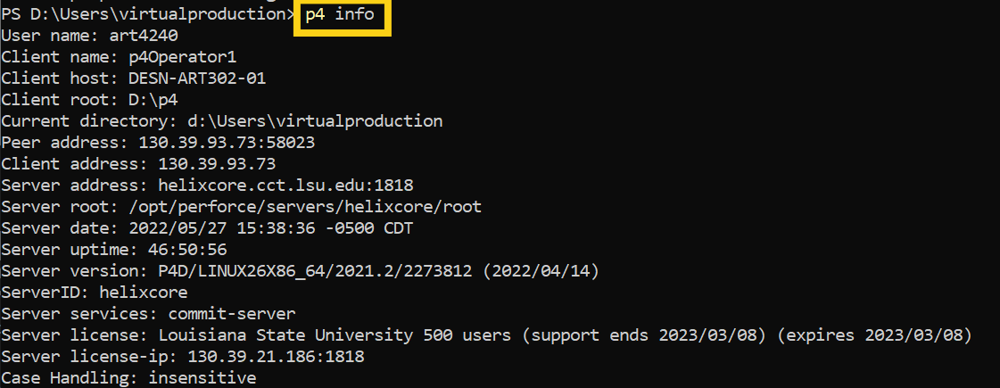
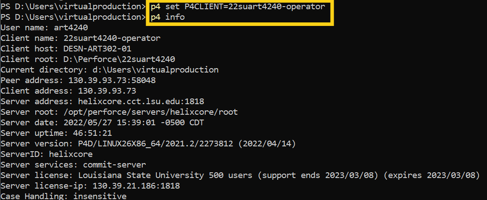

### Setting up Perforce on Operator and Render Nodes

<sub>[previous](../) • [home](../README.md) • [next](../)</sub>


This tutorial helps us get started for new classes/groups using Perforce for a render node and operator in LSU XR Studio.

<br>

---

#### Guide Changes Yet To Make
- [ ] Replace the images to match the new text about multiple users.
- [ ] Add a bit about changing the advaned workspace settings.
- [ ] Add another guide for setting up the VAD workstations with user names like `art4240-vad1`.

#### Pre-reqs

1. Download the Perforce from here: [https://www.perforce.com/downloads/helix-visual-client-p4v](https://www.perforce.com/downloads/helix-visual-client-p4v). 
2. Install both, the command line client and visual client.

#### P4 Admin

1. Create new users that can be shared on the operator and render nodes such as **art4240-operator** and **art4240-render**.
2. Make a new Depot for this group or class named something like **2022-Summer-ART-4240**
3. Give these users permissions for **Templates**

#### P4V

1. Open P4V and connect to ssl:helixcore.cct.lsu.edu:1818 as the user that was made in P4 Admin
    
    
    
2. Go to the Workspaces tab and click **New Workspace** 
    
    
    
3. For Workspace Root ~~choose a directory that all computers can have in common, for instance: **D:\Perforce\22suart4240**.~~ you can pick a location like **C:\Users\virtualproduction\Perforce\22suart4240-operator**. 
4. For Workspace Name choose something unique, for instance: **22suart4240-operator**, **22suart4240-render**, **22suart4240-vad1**.  
5. Rt. Click > **Clear** any depots you don’t want such as OldProjects. 
    
    
    
6. Press Ok
7. Select your Workspace Folder and Press **Get Latest**. This will download all your from your depot.  ****
    
    
    
8. On the **Render Node** repeat the same steps as above to create a new workspace called something like **22suart4240-render**. Make sure the Workspace root is the same as the operator above. Also, click Get Latest.

#### P4 Command Line

1. To make sure the command line version of P4 is in sync with p4v open a command prompt and type `p4 info`  
    
    
    
2. P4 CLI Client Name and User Name should be set to match p4v.
3. Type `p4 set P4USER=art4240-operator`
4. Type `p4 set P4CLIENT=22suart4240-operator`
4. Type `p4 set P4PORT=ssl:helixcore.cct.lsu.edu:1818`
4. Type `p4 set P4IGNORE=.p4ignore`
5. Now check `p4 info` again. 
    
    
    
6. We’re good to go. Our Client name, host, and root all look correct now.
7. Optionally, you could also create a files called `render.p4config` and `operator.p4config` with the following contents and then type `p4 set P4CONFIG=operator.p4config` on the operator machine and  `p4 set P4CONFIG=render.p4config` on the render machine.

    Contents of operator.p4config:
    ```
    P4CLIENT=22suart4240-operator
    P4USER=art4240-operator
    P4PORT=ssl:helixcore.cct.lsu.edu:1818
    P4IGNORE=.p4ignore
    ```
    
    Contents of render.p4config:
    ```
    P4CLIENT=22suart4240-render
    P4USER=art4240-render
    P4PORT=ssl:helixcore.cct.lsu.edu:1818
    P4IGNORE=.p4ignore
    ```

    Contents of vad1.p4config:
    ```
    P4CLIENT=22suart4240-vad1
    P4USER=art4240-vad1
    P4PORT=ssl:helixcore.cct.lsu.edu:1818
    P4IGNORE=.p4ignore
    ```

#### Resources

* [maubanel/p4v-unreal](https://github.com/maubanel/p4v-unreal)

___

| [previous](../)| [home](../README.md) | [next](../)|
|---|---|---|
