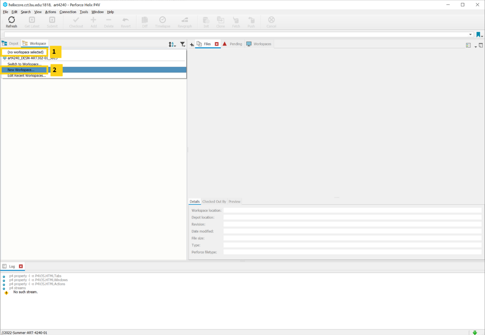
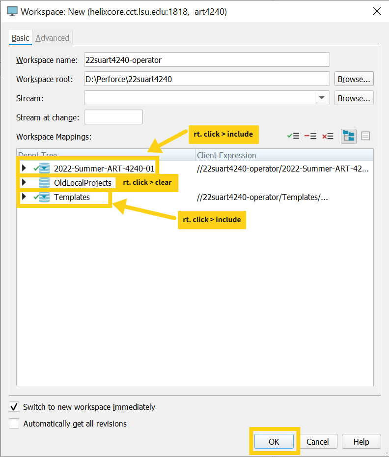
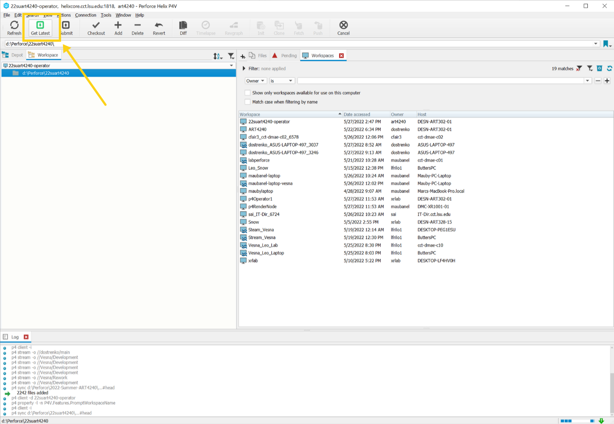

### Setting up Perforce on Operator and Render Nodes

<sub>[previous](../p4-newdepot) • [home](../README.md) • [next](../building-levels)</sub>


This tutorial helps us get started for new classes/groups using Perforce for a render node and operator in LSU XR Studio.

<br>

---

#### Guide Changes Yet To Make
- [ ] Replace the images to match the new text about multiple users.

#### Pre-reqs

1. Download the Perforce from here: [https://www.perforce.com/downloads/helix-visual-client-p4v](https://www.perforce.com/downloads/helix-visual-client-p4v). 
2. Install both, the command line client and visual client.
3. Follow the steps here [p4-newdepot](../p4-newdpot) to setup your Depot in P4 Admin.

#### P4V

1. Open P4V and connect to ssl:helixcore.cct.lsu.edu:1818 as the user that was made in P4 Admin
    
    
    
2. Go to the Workspaces tab and click **New Workspace** 
    
    
    

3. For Workspace Name choose something unique, for instance: **22suart4240-operator** or **22suart4240-render**.

4. For Workspace Root, start with the the default file path, which should be `C:\Users\Virtual Production\Perforce\[WORKSPACE_RANDOM-NUMBER]`. Replace the `RANDOM NUMBER` with the year and semester, for instance `22fa` or `23sp` so you workspace root looks like `C:\Users\Virtual Production\Perforce\scrn4015-render_DMC-XR1001-01_22fa`.

4. Click on the **Advanced** tab and set **Modtime...** to `true` and **rmdir** to `true` and **On submit** to `Revert unchanged files` then press `ok`

5. If you have also chosen a new depot that hasn't had anything submitted to it yet. In the workspace location create a new folder with the same name as the **Depot**, don't forget this is cap sensitive.

7. In **P4V** select `Connection | Edit Current Workspace` then right click on the newly created workspace and **Templates > LSUBaseTemplate** and select `Include Tree`.

7. Rt. Click > **Clear** any depots you don’t want such as OldProjects. 
    
    
    
7. Press Ok

7. Select your Workspace Folder and Press **Get Latest**. This will download all your from your depot.
    
    
    
8. On the **Render Node** repeat the same steps as above to create a new workspace.

#### P4 Command Line

1. To make sure the command line version of P4 is in sync with P4V create two files called `[RENDER_WORKSPACE_NAME].p4config` and `[OPERATOR_WORKSPACE_NAME].p4config` in the root of these workspaces alongside your `.p4ignore` files. 


2. In each file put the following contents:

    Contents of operator.p4config:
    ```
    P4CLIENT=scrn4015-operator_DESN-ART302-01_22fa
    P4USER=scrn4015-operator
    P4PORT=ssl:helixcore.cct.lsu.edu:1818
    P4IGNORE=.p4ignore
    ```
    
    Contents of render.p4config:
    ```
    P4CLIENT=scrn4015-render_DMC-XR1001-01_22fa
    P4USER=scrn4015-render
    P4PORT=ssl:helixcore.cct.lsu.edu:1818
    P4IGNORE=.p4ignore
    ```

3. On each machine, open a command prompt  `p4 set P4CONFIG="PATH TO WORKSPACE/[OPERATOR_WORKSPACE_NAME].p4config"` on the operator machine and  `p4 set P4CONFIG="PATH TO WORKSPACE/[RENDER_WORKSPACE_NAME].p4config"` on the render machine.

4. Last thing we should do is setup our typemapping. Open a command prompt and type `p4 typemap`. Under the word "Typemap" press enter and then tab and past the following:

```
Typemap:
    binary+w //....exe
    binary+w //....dll
    binary+w //....lib
    binary+w //....app
    binary+w //....dylib
    binary+w //....stub
    binary+w //....ipa
    binary+l //....uasset
    binary+l //....umap
    binary+l //....upk
    binary+l //....udk
    binary+l //....ubulk
    binary+wS //..._BuiltData.uasset
```

5. Now check tha values ahave been set with `p4 set` and `p4 info`. 
    
6. We’re good to go. Our Client name, host, and root all look correct now.

#### Resources

* [maubanel/p4v-unreal](https://github.com/maubanel/p4v-unreal)
* https://docs.unrealengine.com/5.0/en-US/using-perforce-as-source-control-for-unreal-engine/
* https://www.perforce.com/products/helix-core/configure-helix-core-game-engine#tab-panel-76008

---


[](../building-levels)


| [previous](../p4-newdepot)| [home](../README.md) | [next](../building-levels)|
|---|---|---|
