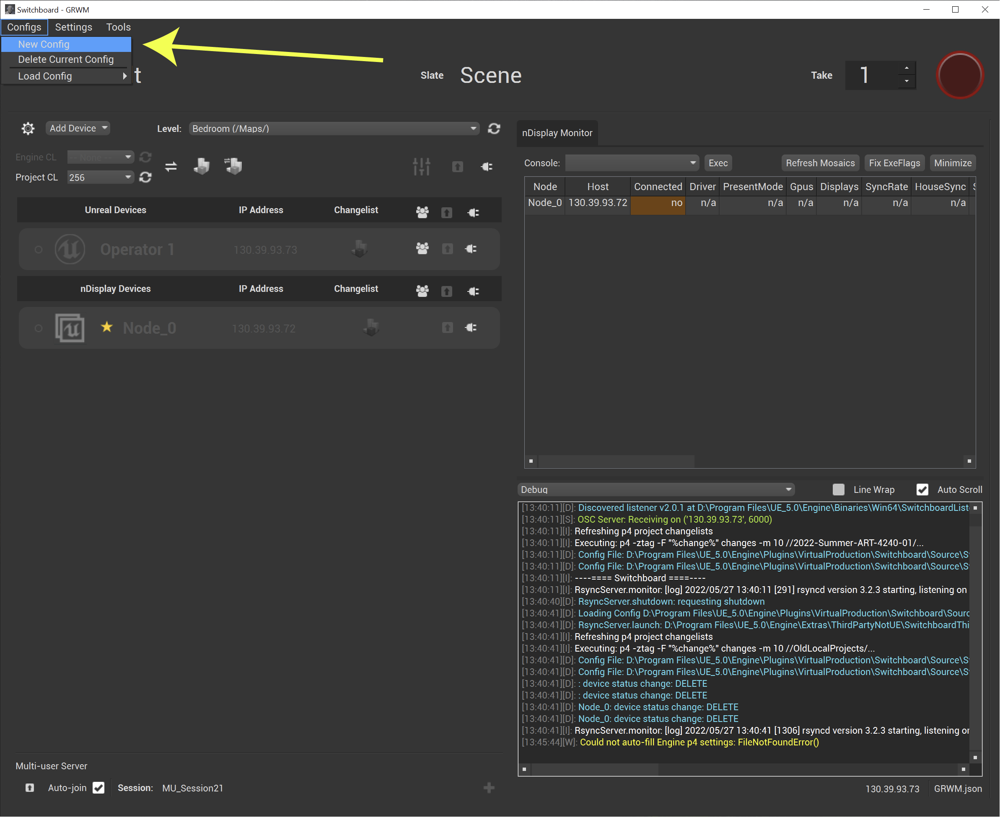
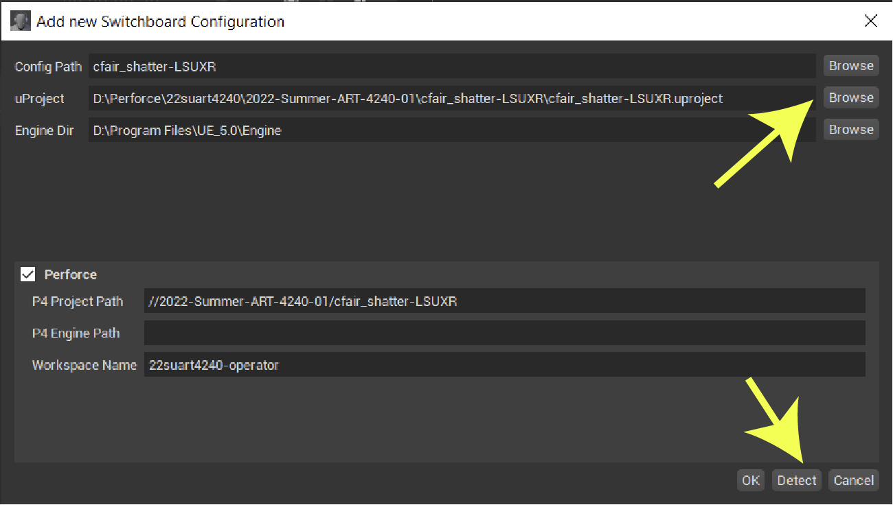
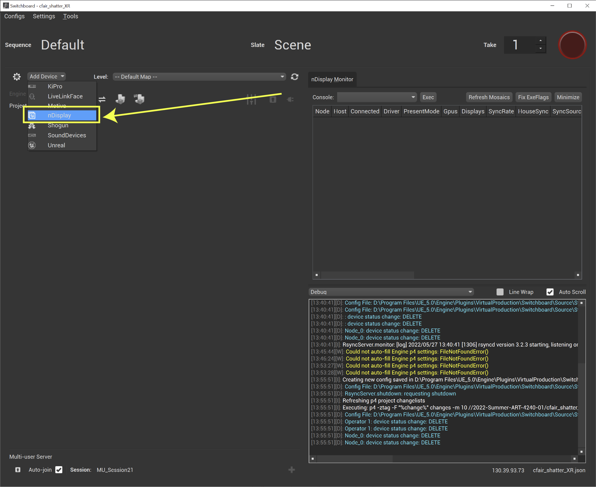
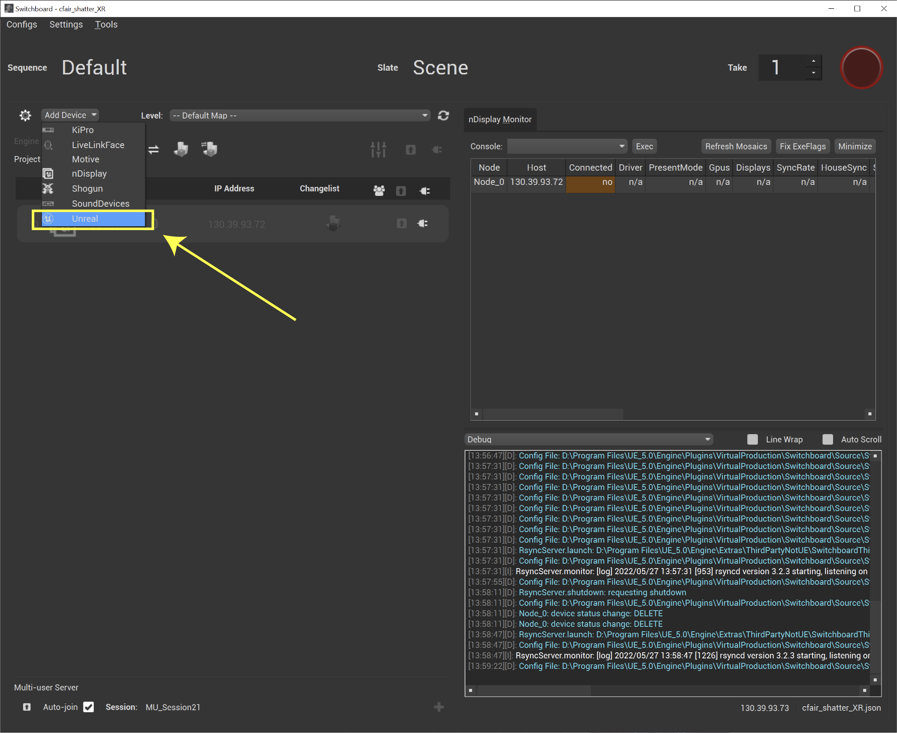
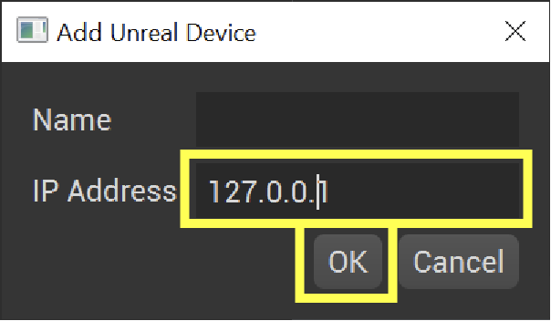
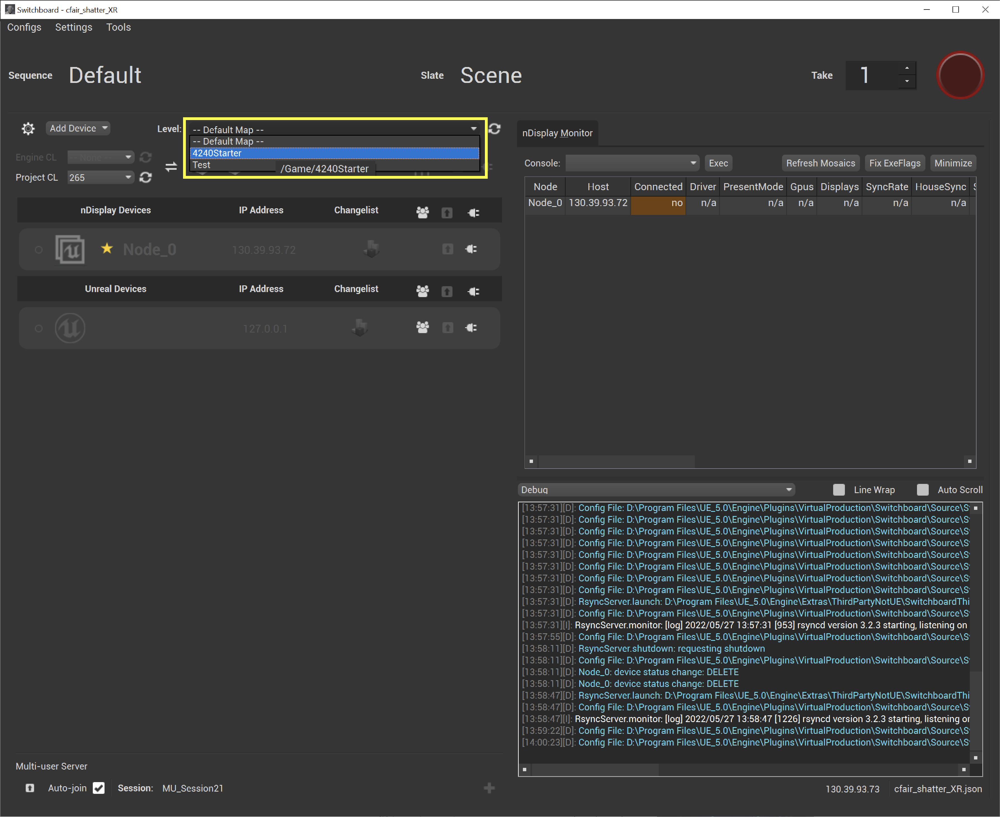
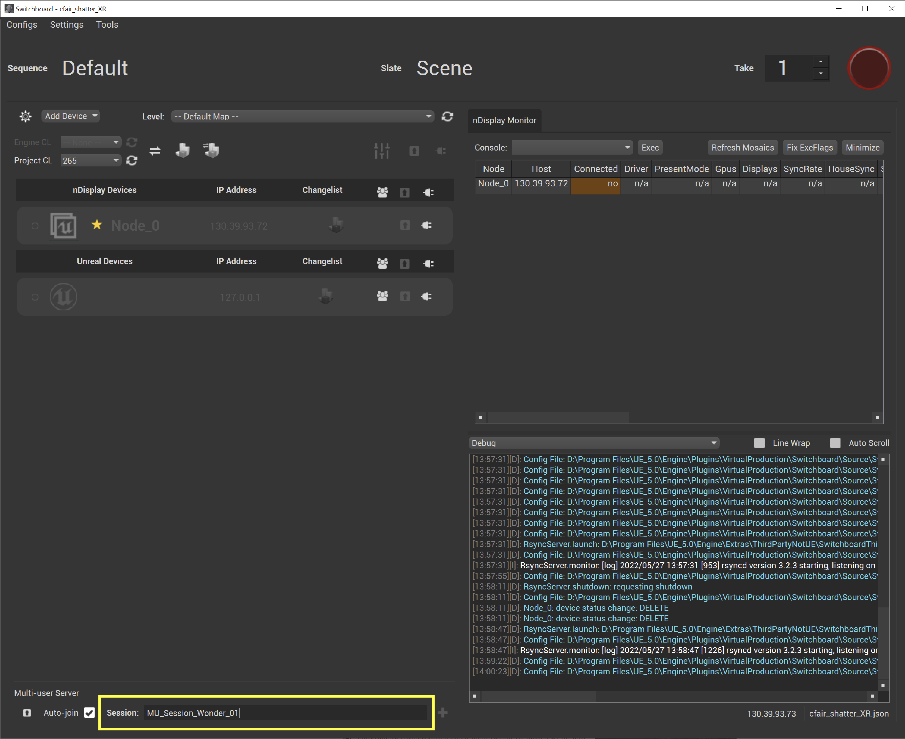

# Switchboard New Config

<sub>[previous](/README.md) • [home](/README.md) • [next](/README.md)</sub>


The following goes over how to create a new switchboard configuration.

<br>

---

## Pre-reqs

1. Before proceeding make sure you’ve setup your Perfoce workspaces. See [Setting up Perforce on Operator and Render Nodes](../operator-and-render/README.md) 
2. Make sure you've setup your scene for nDisplay and camera tracking. It's easiest to start off with the LSUBaseTemplate and build your environment on top of that, but you may also build these components from scratch, or migrate your project into the LSUBaseTemplate, see: [LSU Base Template Migration](../template-migration/README.md).
3. It’s useful to connect the project to source control from within the editor first. This way switchboard can auto-populate some of the fields below.  
4. Make sure to close Unreal if you're going to launch Switchboard from outside the editor. 

## Switchboard

1. If it's not already running, open **Switchboard Listener** using the desktop shortcut. It's also located at D:\Program Files\UE_5.0\Engine\Binaries\Win64\SwitchboardListener.exe.
2. Open **Switchboard** using the desktop shortcut It's also located at D:\Program Files\UE_5.0\Engine\Plugins\VirtualProduction\Switchboard\Source\Switchboard\switchboard.bat.
3. Go to Configs > **New Config**
    
    
    
4. Click **Browse** next to **uProject** and choose the project you want to use.
5. Click **Detect** and as long as your Unreal File has been already connected to Perforce it should bring in your P4 Project Path and Workspace Name. 

    
        
6. If it didn’t, you can check what they are by opening Perforce and copy pasting them in.
7. Click Add Device > **nDisplay**

    
        
8. When asked for an nDisplay config file click **populate** and it should grab the one from inside your project. ie: D:\Users\virtualproduction\Perforce\art4240_DESN-ART302-01_3815\2022-Summer-ART-4240-01\cfair_shatter_XR\cfair_shatter_XR.uproject. 
9. Click Add Device > **Unreal** 
    
    
    
10. Use **127.0.0.1** for the IP address 

    
        
11. Go to Settings and change the **nDisplay Node_0 Workspace Name** to the workspace on that computer (i.e. 22suart4240-render).

    
        
12. Choose your **Level**. For the first time you might have to press the **Refresh** button to see the levels.
    
    
    
13. Name Your Multi-User Session something like **MU_Session_ProjectName_01** and press Enter.
    
    
    
14. Click 1) Refresh Change Lists; 2) Connect to Listener on nDisplay; 3) Connect to Listener on Unreal Device; 4) Sync all device; 5) Build all devices. 6) Connect All Devices; 7) Start All devices.

15. After about a minute the Unreal editor should open up on the operator and an Unreal build should  open on the render node(s).

## Troubleshooting

- If you get an error that you can't join your session or the "Joining Unreal Session" popup doesn't go away there may be multiuser sessions already running that conflict and that you can’t delete. One way to do fix this is to run the following and then press CTRL-C to exit.
    
    ```bash
    cd "D:\Program Files\UE_5.0\Engine\Binaries\Win64\”
    .\UnrealMultiUserServer.exe -ConcertClean
    ```
    
- If you get an error in Switchboard that says “Could not start program p4” when switching workspaces try logging out and in again. I suspect p4 variables need to be reloaded.

- If you get an error in Switchboard asking if we're connected to Source Control. Run the command `p4 login` from the command prompt. 

- Sometimes we have Unreal "ghost sessions" you can use Windows Tasks Manager to look for any instances of Unreal running in the background and close them down. 

- If you get the error message `Operator already running cstat_project a9508bb6-992c-4268-9989-27c16639908b` make sure to close out the multi user server window.

- If you get the error message `Node_0: Could not retrieve changelists for project. Are the Source Control Settings correctly configured?` open a command prompt and type `p4 login` followed by the yser passwoird and enter.

## Resources

[In-Camera VFX Quick Start](https://docs.unrealengine.com/5.0/en-US/in-camera-vfx-quick-start-for-unreal-engine/)

[In-Camera VFX Production Test](https://docs.unrealengine.com/5.0/en-US/in-camera-vfx-production-test-sample-project-for-unreal-engine/)

---

| [previous](/README.md)| [home](/README.md) | [next](/README.md)|
|---|---|---|
