### Timecode & Sync

[previous](../hdr5-output/README.md#user-content-hdr-output) • [home](../README.md#user-content-gms2-background-tiles--sprites---table-of-contents)

We are almost ready to go.  The only thing we need to add is timecode and sync. Timecode allows us to record the live link data and sync it back later in post.  Sync is required so that the game engine updates frames at the same time as the camera and monitor. Without it you would have tearing if the game moves the camera in the scene instead of the camera tracker.

 

---

##### `Step 1.`\|`BTS`|:small_blue_diamond:

In our case in our **Caputure PC** we have a BlackMagic Decklink 8K card.  Our **RED Komodo** camera goes into the black magic by SDI. Go to the **Stages** folder and press the <kbd>+ Add</kbd> and open up **ALL CLASSES** and select `BlackmagicTimecodeProvider(Balckmagic SDI Input)`. It is VERY importnat that this card is getting genlock sync from our sync generator.

##### `Step 2.`\|`BTS`|:small_blue_diamond: :small_blue_diamond: 

Call the blueprint `BP_BlackMagic_Timecode`.

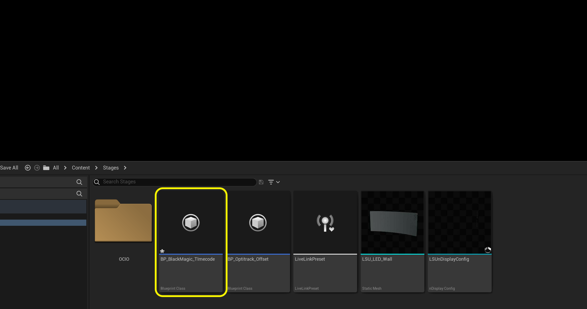

##### `Step 3.`\|`BTS`|:small_blue_diamond: :small_blue_diamond: :small_blue_diamond:

The black magic capture card that receives the camera signal in our capture PC then sends it to the operator machine to feed it timecode.  We can open up **Black Magic Desktop Video Setup** and see that it is inputing 4K30 DCI and outputing 4K30 DCI.  This is consistent with the signal coming from the camera.

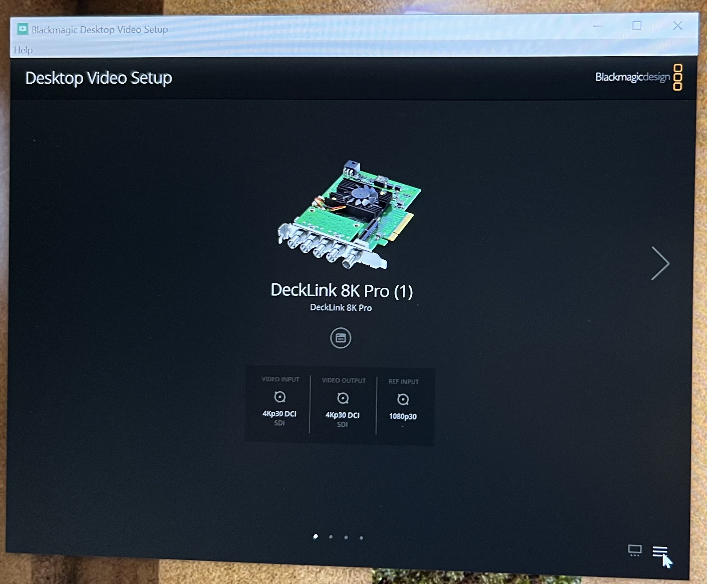

##### `Step 4.`\|`BTS`|:small_blue_diamond: :small_blue_diamond: :small_blue_diamond: :small_blue_diamond:

We have setup the **BlackMagic Decklink** card so that any of the **SDI** connectors can be inputs or outputs.  It recognizes that we are using channel 1 as an input and channel 2 as an output.

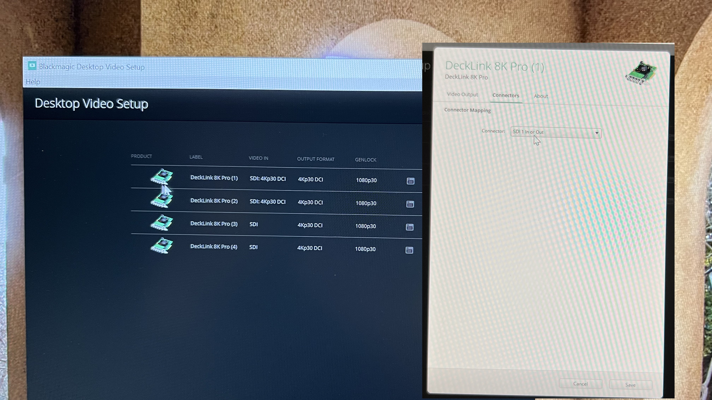

##### `Step 5.`\|`BTS`| :small_orange_diamond:

Now we are using **Assimilate Live-FX** to record and feed timecode to our opertaor machine.  Open up **Live Effects** and select **Settings**.

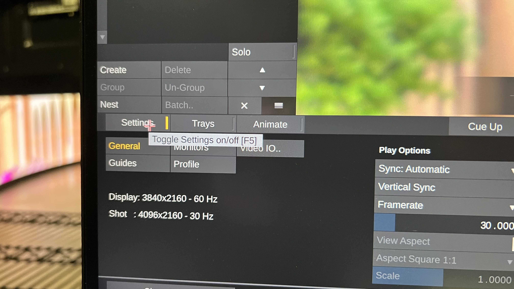

##### `Step 6.`\|`BTS`| :small_orange_diamond: :small_blue_diamond:

Now select **Video IO..**.

##### `Step 7.`\|`BTS`| :small_orange_diamond: :small_blue_diamond: :small_blue_diamond:

Select the **DeckLink 8K Pro** as the device that we are inputting.  The camera is wired into channel 1.  Turn this **On** and set it as the **Input**. Our second channel is going from this decklink to the **BlackMagic** card in the operator PC that needs this signal to read the timecode.  So we set channel 2 to **On** and set it as **Output**. We also set this to our camera format which is **4Kp30 DCI at 4096 x 2160**.

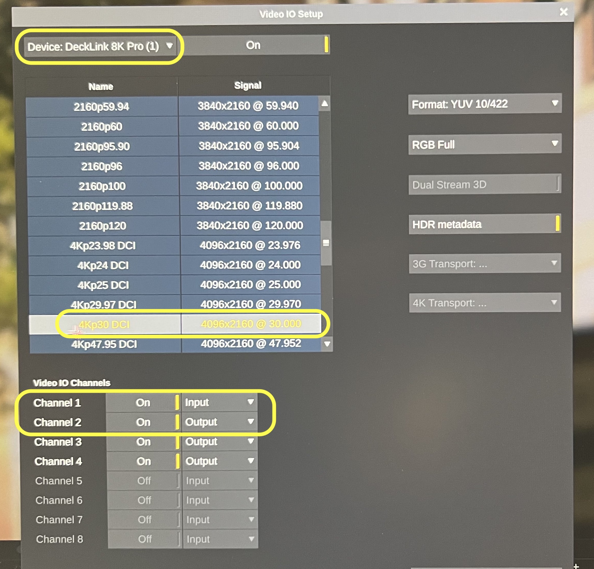

##### `Step 8.`\|`BTS`| :small_orange_diamond: :small_blue_diamond: :small_blue_diamond: :small_blue_diamond:

Now go to the **Operator** machine and we have another black magic card set up to ingest the video.  Run the **Black Magic** software and confirm you are receiving a video signal. If it is working you will see the camera in the operator computer (make sure Unreal is not running at this time).  Remember, only one piece of software can get a video input at a time.  

##### `Step 9.`\|`BTS`| :small_orange_diamond: :small_blue_diamond: :small_blue_diamond: :small_blue_diamond: :small_blue_diamond:

Quit the black magic software and open the project in **Unreal**. Now open up **BP_BlackMagic_Timecode** and our input card for the **Operator 1** is an **UltraStudio 4K Mini**. Set this as the input card at **4K DCI** and **30 fps** then press the <kbd>Apply</kbd> button.

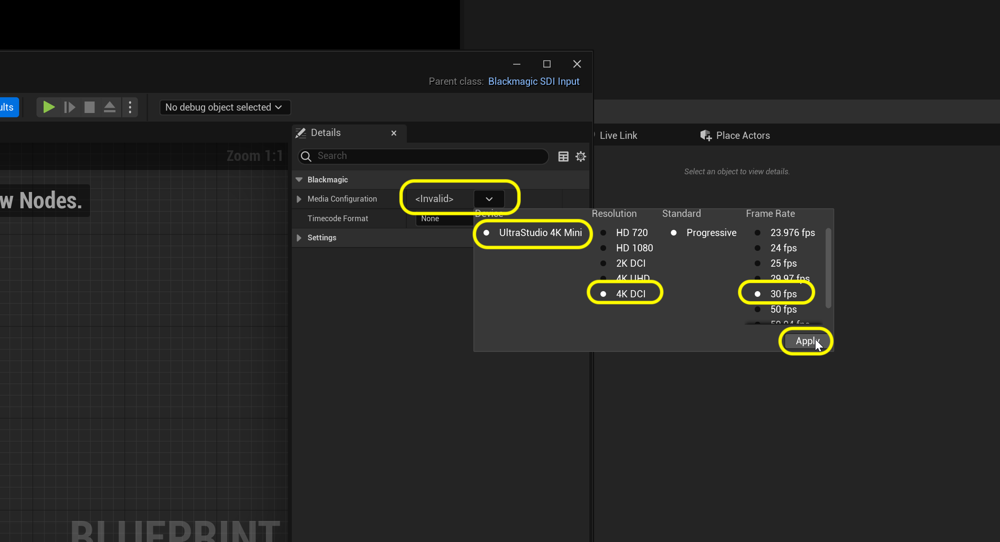

##### `Step 10.`\|`BTS`| :large_blue_diamond:

Now set the **Timecode Format** to `LTC`.

##### `Step 11.`\|`BTS`| :large_blue_diamond: :small_blue_diamond: 

Now to make this all work the final step is to open **Edit | Project Settings** and set the **Timecode Provider** as the blueprint we just configured `BP_Blackmagic_Timecode`.

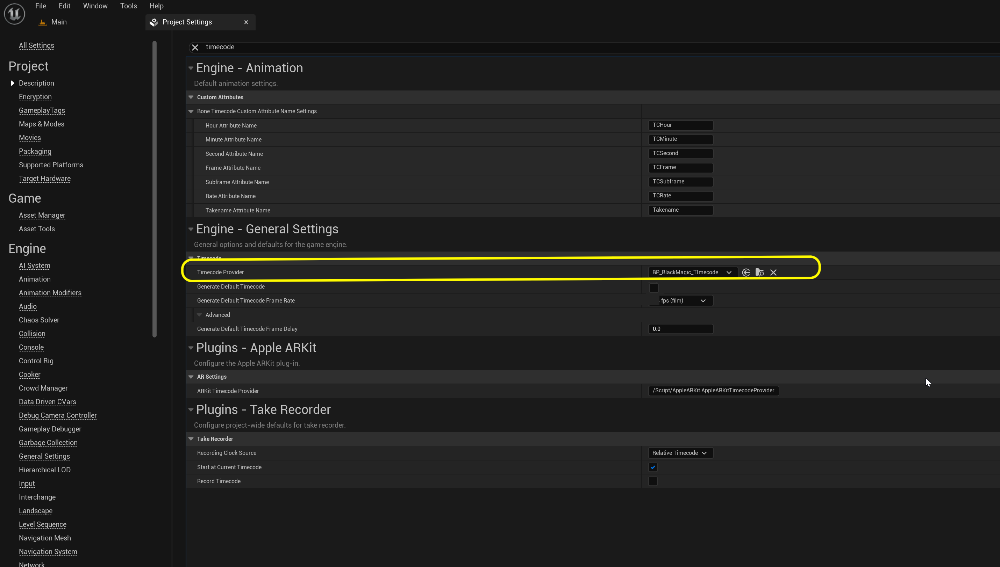

##### `Step 12.`\|`BTS`| :large_blue_diamond: :small_blue_diamond: :small_blue_diamond: 

To see the timecode open up **Window | Virtual Production | Timecode Provider**.

##### `Step 13.`\|`BTS`| :large_blue_diamond: :small_blue_diamond: :small_blue_diamond:  :small_blue_diamond: 

Double check that the timecode in Unreal is the same as our source (in this case our timecode source is coming from the camera).

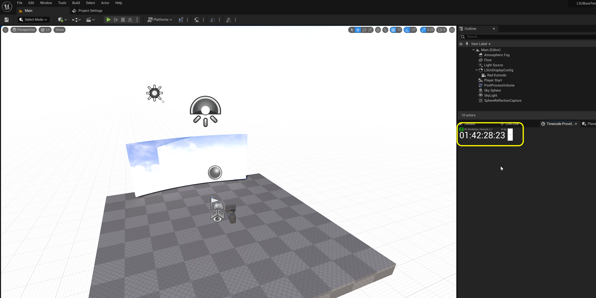

##### `Step 14.`\|`BTS`| :large_blue_diamond: :small_blue_diamond: :small_blue_diamond: :small_blue_diamond:  :small_blue_diamond: 

Now we can stripe timcecode to our digital content in Unreal.  We also want to sync our Unreal game to match the rest of the system (camera, opti track cameras, both Blackmagic sync cards, render node pc).  Select the **Stages** folder and press the <kbd>+ Add</kbd> button and select **Blueprint**.  Open up **ALL CLASSES** and select `BlackmagicCustomTimeStep(Blackmagic SDI Input)`.
 Call the blueprint `BP_BlackMagic_GenLock`.

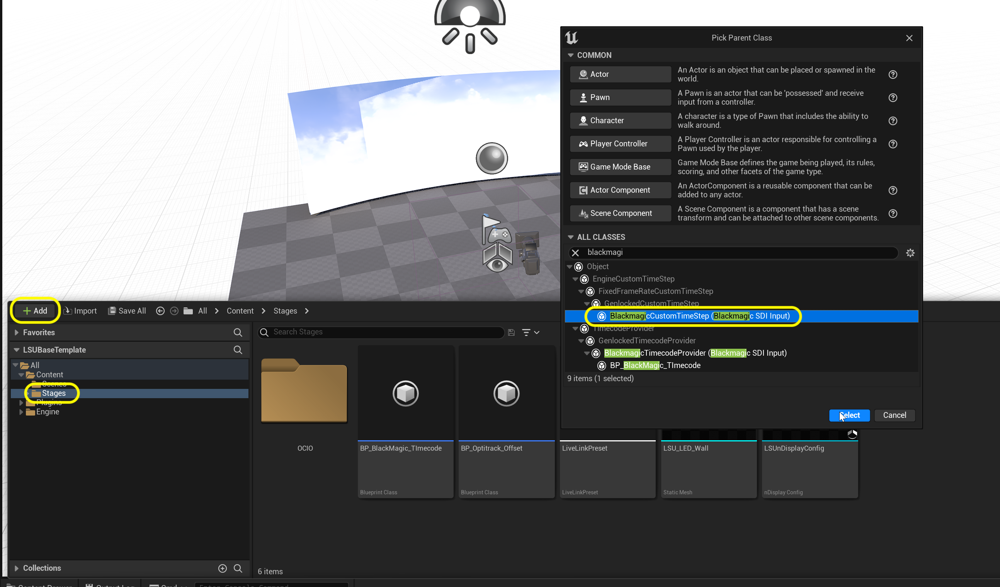

##### `Step 15.`\|`BTS`| :large_blue_diamond: :small_orange_diamond: 

Now select the same input card settings we picked for the timecode with **UltraStudio 4K Mini** with **4K DCI**, **Progressive** scan and **30 fps**.

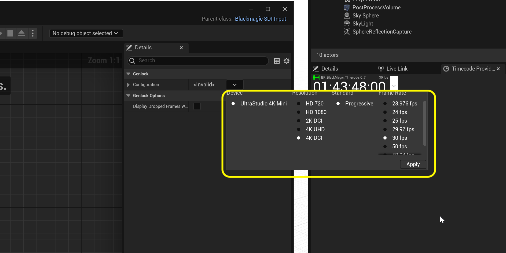

##### `Step 16.`\|`BTS`| :large_blue_diamond: :small_orange_diamond:   :small_blue_diamond: 

Open up **Edit | Project Settings** and set the **Framerate | Advanced | Custom TimeStep** to `BP_BlackMagic_GenLock`.

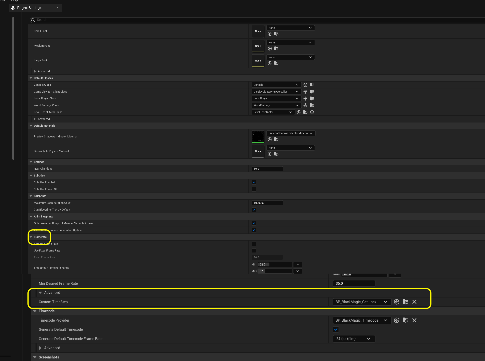

##### `Step 17.`\|`BTS`| :large_blue_diamond: :small_orange_diamond: :small_blue_diamond: :small_blue_diamond:

Go to the **Render Node** pc and check the **NVidia Settings**. 

##### `Step 18.`\|`BTS`| :large_blue_diamond: :small_orange_diamond: :small_blue_diamond: :small_blue_diamond: :small_blue_diamond:

##### `Step 19.`\|`BTS`| :large_blue_diamond: :small_orange_diamond: :small_blue_diamond: :small_blue_diamond: :small_blue_diamond: :small_blue_diamond:

##### `Step 20.`\|`BTS`| :large_blue_diamond: :large_blue_diamond:

##### `Step 21.`\|`BTS`| :large_blue_diamond: :large_blue_diamond: :small_blue_diamond:

___

| [previous](../hdr5-output/README.md#user-content-hdr-output)| [home](../README.md#user-content-gms2-background-tiles--sprites---table-of-contents) | 
|---|---|

syncTimecode